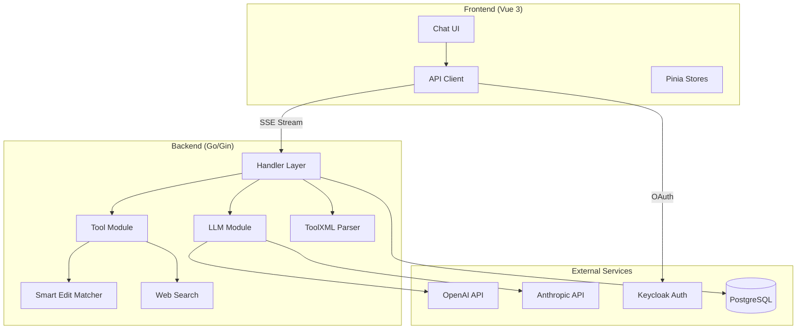
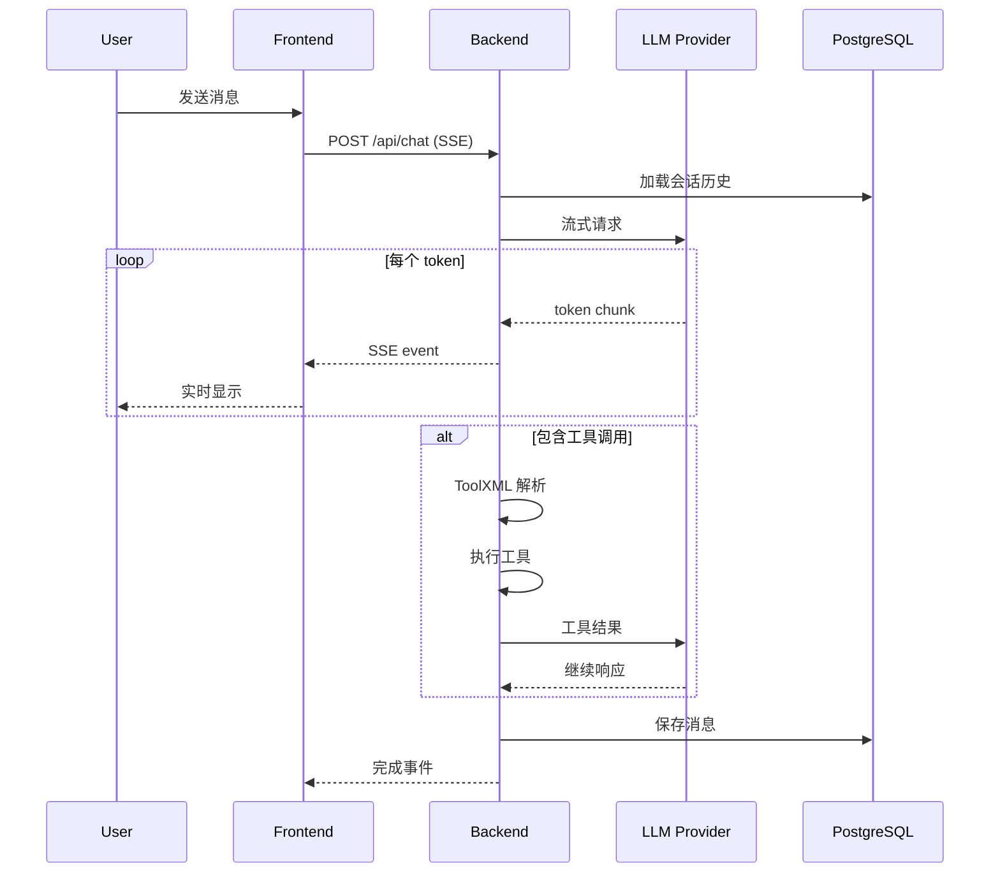

# oneAgent 项目技术概览

> 一个现代化的 AI 对话应用，基于 Go + Vue 3 构建，支持多 LLM 提供商、工具调用和实时流式响应。

---

## 系统架构



---

## 技术栈

| 层级 | 技术 | 用途 |
|------|------|------|
| **Frontend** | Vue 3 + TypeScript | SPA 框架 |
| | Tailwind CSS | 样式系统 |
| | Pinia | 状态管理 |
| | Vue Query | 异步数据管理 |
| **Backend** | Go 1.22+ | 服务端语言 |
| | Gin | HTTP 框架 |
| | GORM | ORM |
| **Database** | PostgreSQL 16 | 持久化存储 |
| **Auth** | Keycloak | OIDC 认证 |
| **部署** | Docker Compose | 容器编排 |

---

## 模块概览

### Backend 模块

| 模块 | 路径 | 职责 |
|------|------|------|
| [LLM](backend/01-llm-module.md) | `internal/llm` | OpenAI/Anthropic API 客户端，流式响应处理 |
| [Tool](backend/02-tool-module.md) | `internal/tool` | 工具注册表，bash/edit/search 实现 |
| [ToolXML](backend/03-toolxml-module.md) | `internal/toolxml` | XML 格式工具调用解析引擎 |
| [Handler](backend/04-handler-module.md) | `internal/handler` | HTTP API 端点 (chat/session/oauth) |
| [Model](backend/05-model-module.md) | `internal/model` | 数据模型定义 |
| [SBE](backend/06-sbe-module.md) | `internal/sbe` | 智能编辑模糊匹配 |
| [Bocha](backend/07-bocha-module.md) | `internal/bocha` | Web 搜索集成 |

### Frontend 模块

| 模块 | 路径 | 职责 |
|------|------|------|
| [架构](frontend/01-frontend-architecture.md) | `src/` | Vue 3 应用架构 |
| [组件](frontend/02-components.md) | `src/components` | UI 组件库 |

---

## 数据流

### 聊天请求处理流程



---

## API 端点概览

| Method | Path | 描述 |
|--------|------|------|
| `POST` | `/api/chat` | 流式聊天 (SSE) |
| `GET` | `/api/sessions` | 会话列表 |
| `GET` | `/api/sessions/:id` | 获取会话详情 |
| `DELETE` | `/api/sessions/:id` | 删除会话 |
| `POST` | `/api/sessions/:id/truncate` | 截断会话消息 |
| `GET/POST/PUT/DELETE` | `/api/llm/providers` | LLM 提供商 CRUD |
| `GET/POST/PUT/DELETE` | `/api/llm/models` | 模型配置 CRUD |
| `GET` | `/api/tools` | 获取工具列表 |
| `GET/PUT` | `/api/bocha/settings` | 搜索设置 |
| `POST` | `/api/bocha/search` | Web 搜索 |
| `GET` | `/api/auth/config` | 获取认证配置 |
| `POST` | `/api/auth/callback` | OAuth 回调 |

---

## 环境变量

| 变量 | 描述 | 默认值 |
|------|------|--------|
| `PORT` | 服务端口 | `8080` |
| `DATABASE_URL` | PostgreSQL 连接字符串 | - |
| `KEYCLOAK_URL` | Keycloak 地址 | - |
| `KEYCLOAK_REALM` | Keycloak Realm | `base-realm` |
| `KEYCLOAK_CLIENT_ID` | Keycloak Client | `base-app` |
| `ENABLE_TRACE` | 启用调试输出 | `false` |

---

## 快速开始

```bash
# 克隆并启动
cd oneAgent
cp .env.example .env
docker-compose up --build

# 访问应用: http://localhost:8080
# Keycloak: http://localhost:8180 (admin/admin123)
```
