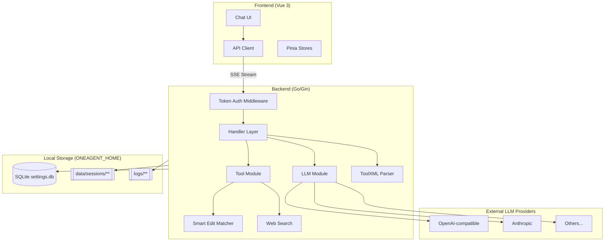
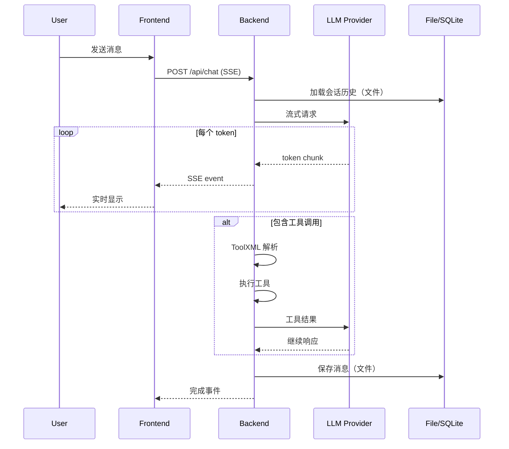

# oneAgent 项目技术概览

> 一个“本地工具形应用”(local tool) 的 AI 对话应用：Go 后端内嵌 Vue 3 前端，支持多 LLM 提供商、工具调用与 SSE 流式响应。

## 默认运行画像（local tool）

- 统一入口：`oneagent` CLI（`serve`/`doctor`）
- 默认认证：本地访问令牌 `AUTH_MODE=token`（不依赖 Keycloak/OAuth）
- 默认存储：Settings SQLite + 其它状态文件存储（会话/日志）
- 默认约定：面向局域网（LAN）使用；不依赖 “按 IP 阻断公网访问”

## 系统架构（local tool）



## 技术栈

| 层级 | 技术 | 用途 |
|------|------|------|
| **Frontend** | Vue 3 + TypeScript | SPA |
| | Tailwind CSS | 样式系统 |
| | Pinia | 状态管理 |
| | Vue Query | 异步数据管理 |
| **Backend** | Go | 服务端语言 |
| | Gin | HTTP 框架 |
| **Storage** | SQLite | Settings（API keys 等敏感配置） |
| | File Storage | 会话/消息/日志 |
| **Auth** | Local Token | `Authorization: Bearer <token>` |
| **交付** | 单可执行文件 | `oneagent serve` |

---

## 模块概览

### Backend 模块

| 模块 | 路径 | 职责 |
|------|------|------|
| [LLM](backend/01-llm/00-overview.md) | `internal/llm` | OpenAI/Anthropic API 客户端，流式响应处理 |
| [Tool](backend/02-tool/00-overview.md) | `internal/tool` | 工具注册表，bash/edit/search 实现 |
| [ToolXML](backend/03-toolxml/00-overview.md) | `internal/toolxml` | XML 格式工具调用解析引擎 |
| [Handler](backend/04-handler/00-overview.md) | `internal/handler` | HTTP API 端点 (chat/session/oauth) |
| [Model](backend/05-model/00-overview.md) | `internal/model` | 数据模型定义 |
| [SBE](backend/06-sbe/00-overview.md) | `internal/sbe` | 智能编辑模糊匹配 |
| [Bocha](backend/07-bocha/00-overview.md) | `internal/bocha` | Web 搜索集成 |

### Frontend 模块

| 模块 | 路径 | 职责 |
|------|------|------|
| [架构](frontend/01-frontend-architecture.md) | `src/` | Vue 3 应用架构 |
| [组件](frontend/02-components.md) | `src/components` | UI 组件库 |

---

## 数据流

### 聊天请求处理流程



---

## API 端点概览

| Method | Path | 描述 |
|--------|------|------|
| `POST` | `/api/chat` | 流式聊天 (SSE) |
| `GET` | `/api/sessions` | 会话列表 |
| `GET` | `/api/sessions/:id` | 获取会话详情 |
| `DELETE` | `/api/sessions/:id` | 删除会话 |
| `POST` | `/api/sessions/:id/truncate` | 截断会话消息 |
| `GET/POST/PUT/DELETE` | `/api/llm/providers` | LLM 提供商 CRUD |
| `GET/POST/PUT/DELETE` | `/api/llm/models` | 模型配置 CRUD |
| `GET` | `/api/tools` | 获取工具列表 |
| `GET/PUT` | `/api/bocha/settings` | 搜索设置 |
| `POST` | `/api/bocha/search` | Web 搜索 |
| `GET` | `/api/auth/config` | **废弃**（返回 410） |
| `POST` | `/api/auth/callback` | **废弃**（返回 410） |

---

## 环境变量

| 变量 | 描述 | 默认值 |
|------|------|--------|
| `ONEAGENT_HOME` | Home 目录（agent 可写边界） | `~/.oneagent_default` |
| `PROFILE` | `local`/`dev` | `local` |
| `BIND` | 监听地址 | local=`0.0.0.0` |
| `PORT` | 服务端口 | `8080` |
| `AUTH_MODE` | `token`/`none` | `token` |
| `ENABLE_TRACE` | 启用 trace | `false` |
| `BASH_ROOT_DIR` | bash/文件工具根目录 | `ONEAGENT_HOME` |
| `LOG_RETENTION_DAYS` | 日志保留天数 | `30` |

---

## 快速开始

```bash
make build
./dist/oneagent serve
```
