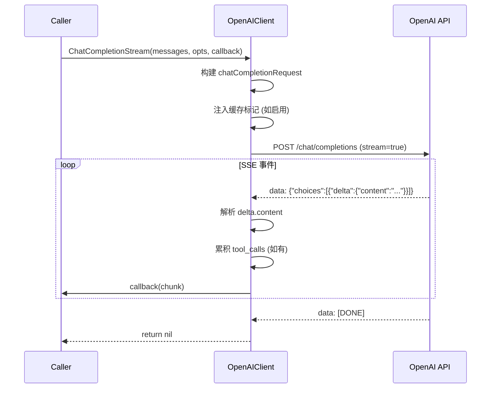
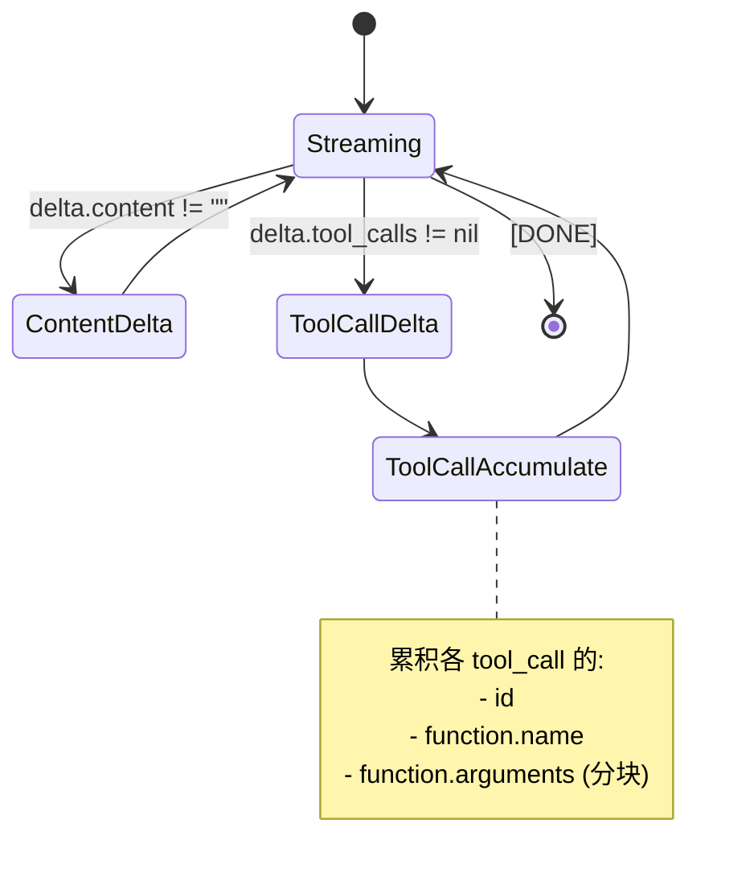

# LLM 模块技术规格

> `backend/internal/llm` - LLM 客户端抽象层，支持 OpenAI、Anthropic 及兼容 API。

**代码规模**: ~1920 行 | **核心文件**: `llm.go` (756), `anthropic.go` (667), `openai_responses.go` (260), `factory.go` (106)

---

## 1. API & Interface Contract

### 1.1 Client 接口定义

```go
// Client 定义 LLM 交互的标准接口
type Client interface {
    // ChatCompletion 执行非流式请求，返回完整响应
    ChatCompletion(ctx context.Context, messages []ChatMessage, opts *ChatCompletionOptions) (string, error)
    
    // ChatCompletionStream 执行流式请求，通过回调逐块返回
    ChatCompletionStream(ctx context.Context, messages []ChatMessage, opts *ChatCompletionOptions, callback StreamCallback) error
}

// StreamCallback 流式回调函数
type StreamCallback func(chunk string) error
```

### 1.2 ChatMessage 结构

```go
type ChatMessage struct {
    Role         string        `json:"role"`          // system | user | assistant | tool
    Content      string        `json:"content"`       // 消息内容
    
    // 缓存控制 (Provider 特定)
    CacheControl *CacheControl `json:"cache_control,omitempty"` // Anthropic 风格
    CachePoint   *CacheControl `json:"cachePoint,omitempty"`    // DeepSeek 风格
    
    // 工具调用支持
    Name         string        `json:"name,omitempty"`          // 工具消息的函数名
    ToolCalls    []ToolCall    `json:"tool_calls,omitempty"`    // 助手发起的工具调用
    ToolCallID   string        `json:"tool_call_id,omitempty"`  // 工具响应关联 ID
}
```

### 1.3 ChatCompletionOptions 配置

```go
type ChatCompletionOptions struct {
    Model             string    // 模型覆盖
    Temperature       *float64  // 0.0 - 2.0
    MaxTokens         *int      // 最大输出 token
    TopP              *float64  // 核采样
    FrequencyPenalty  *float64  // -2.0 - 2.0
    PresencePenalty   *float64  // -2.0 - 2.0
    Stop              []string  // 停止序列
    
    // 缓存配置
    PromptCacheKey    string    // 缓存键 (用于 session 级别)
    EnablePromptCache bool      // 启用 KV 缓存
    
    // 工具配置
    Tools             []Tool    // 可用工具列表
    ToolChoice        any       // "auto" | "none" | {"type":"function","function":{"name":"xxx"}}
    
    // 追踪回调
    Trace             *TraceCallback
}
```

### 1.4 TraceCallback 追踪接口

```go
type TraceCallback struct {
    OnStart      func(ctx context.Context, input []ChatMessage)  // 请求开始
    OnFirstToken func(ctx context.Context)                       // 首 token 到达
    OnToken      func(ctx context.Context, token string)         // 每个 token
    OnComplete   func(ctx context.Context, output string, err error) // 请求完成
}
```

---

## 2. Provider 实现

### 2.1 支持的 Provider 类型

| ProviderType | 实现类 | 缓存风格 | API 端点 |
|--------------|--------|---------|---------|
| `openai` | `OpenAIClient` | None | `/chat/completions` |
| `openai_response` | `OpenAIResponsesClient` | None | `/responses` |
| `claude` | `AnthropicClient` | Anthropic | `/messages` |
| `openrouter` | `OpenAIClient` | OpenRouter | `/chat/completions` |
| `bedrock` | `OpenAIClient` | None | 兼容端点 |
| `deepseek` | `OpenAIClient` | DeepSeek | `/chat/completions` |
| `zhipuai` | `OpenAIClient` | None | `/chat/completions` |
| `minimax` | `OpenAIClient` | None | `/chat/completions` |
| `antigravity` | `OpenAIClient` | Anthropic | `/chat/completions` |
| `codex` | `OpenAIClient` | None | `/chat/completions` |

### 2.2 工厂函数

```go
func NewClientForProvider(cfg ProviderConfig) (Client, error)

type ProviderConfig struct {
    ProviderType string        // Provider 类型
    Endpoint     string        // API 端点
    APIKey       string        // API 密钥
    Model        string        // 默认模型
    Timeout      time.Duration // 请求超时
}
```

---

## 3. Logic Flow & Visualization

### 3.1 OpenAI 兼容流式处理



### 3.2 Anthropic 消息格式转换

```mermaid
graph LR
    subgraph 输入
        A[ChatMessage\nRole: system/user/assistant]
    end
    
    subgraph 转换
        B[提取 System Prompt]
        C[合并相邻 User 消息]
        D[转换 Assistant 工具调用]
        E[转换 Tool Result]
    end
    
    subgraph 输出
        F[anthropicRequest\nsystem: string\nmessages: anthropicMessage[]]
    end
    
    A --> B --> C --> D --> E --> F
```

### 3.3 缓存控制风格

```go
type cacheControlStyle int

const (
    cacheControlStyleNone      cacheControlStyle = iota // 不缓存
    cacheControlStyleAnthropic                          // cache_control: {type: "ephemeral"}
    cacheControlStyleDeepSeek                           // cachePoint: {type: "ephemeral"}
    cacheControlStyleOpenRouter                         // 请求头: X-OpenRouter-Provider-Order
)
```

**缓存注入位置**:
1. System Prompt (首条)
2. 最后一条 User 消息

### 3.4 工具调用流式处理



---

## 4. Sad Path Matrix

| 场景 | 错误类型 | 处理策略 | 上层表现 |
|------|---------|---------|---------|
| **无效 API Key** | 401 | 返回 `API error (status 401)` | 提示配置错误 |
| **模型不存在** | 404 | 返回 `API error (status 404)` | 提示模型无效 |
| **Rate Limit** | 429 | 返回 `API error (status 429)` | 显示限流错误 |
| **网络超时** | Timeout | 返回 `request failed: context deadline exceeded` | 显示超时 |
| **流读取错误** | IO | 返回 `stream read error` + 已收内容 | 部分响应 |
| **JSON 解析失败** | Parse | 静默跳过，继续读取 | 可能丢失部分内容 |
| **工具参数格式错误** | Validation | 归一化为有效 JSON | 自动修复 |
| **不支持的 Provider** | Config | 返回 `unsupported provider type` | 配置错误 |
| **空响应** | API | 返回空字符串 | 无内容 |
| **SSE 格式异常** | Parse | 跳过异常行 | 部分内容 |

---

## 5. Data Persistence

LLM 模块不直接持久化，但通过 `TraceCallback` 支持调用追踪。

### 5.1 请求结构 (OpenAI 兼容)

```json
POST /chat/completions
{
    "model": "gpt-4",
    "messages": [
        {"role": "system", "content": "..."},
        {"role": "user", "content": "..."}
    ],
    "stream": true,
    "temperature": 0.7,
    "max_tokens": 4096,
    "tools": [
        {
            "type": "function",
            "function": {
                "name": "bash",
                "description": "执行 bash 命令",
                "parameters": {"type": "object", "properties": {...}}
            }
        }
    ]
}
```

### 5.2 Anthropic 请求结构

```json
POST /messages
{
    "model": "claude-3-opus-20240229",
    "max_tokens": 8192,
    "system": "...",
    "messages": [
        {"role": "user", "content": [{"type": "text", "text": "..."}]}
    ],
    "tools": [...]
}

Headers:
- anthropic-version: 2023-06-01
- anthropic-beta: prompt-caching-2024-07-31
```

### 5.3 工具参数归一化

```go
// normalizeToolCallArguments 修复常见的 JSON 格式问题
func normalizeToolCallArguments(args string) string {
    // 1. 处理 Python-style True/False/None
    // 2. 处理未转义的换行符
    // 3. 处理无引号的字符串值
}
```

---

## 6. 辅助函数

### 便捷构造器

```go
func BuildSystemMessage(content string) ChatMessage
func BuildUserMessage(content string) ChatMessage
func BuildAssistantMessage(content string) ChatMessage
func BuildToolResultMessage(toolCallID, name, content string) ChatMessage
```

### 缓存支持检测

```go
func SupportsPromptCacheKey(providerType string) bool
// 返回 true: openai_response, deepseek
// 返回 false: 其他
```
