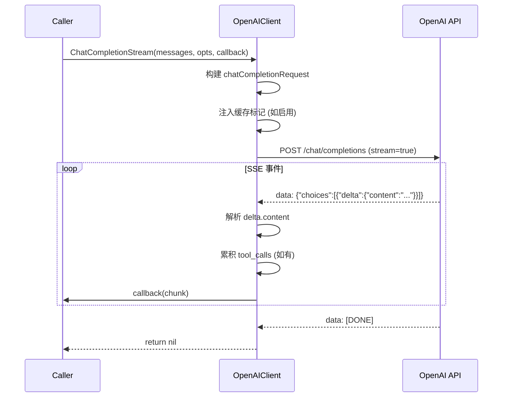
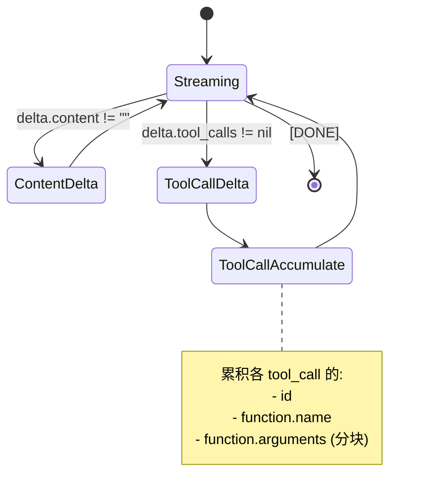

# LLM 模块：设计

> `backend/internal/llm`

> 本文档包含原技术规格的第 3 章（流程与可视化）；其余章节见 [细节](01-details.md)。

---

## 3. Logic Flow & Visualization

### 3.1 OpenAI 兼容流式处理



### 3.2 Anthropic 消息格式转换

```mermaid
graph LR
    subgraph 输入
        A[ChatMessage\nRole: system/user/assistant]
    end
    
    subgraph 转换
        B[提取 System Prompt]
        C[合并相邻 User 消息]
        D[转换 Assistant 工具调用]
        E[转换 Tool Result]
    end
    
    subgraph 输出
        F[anthropicRequest\nsystem: string\nmessages: anthropicMessage[]]
    end
    
    A --> B --> C --> D --> E --> F
```

### 3.3 缓存控制风格

```go
type cacheControlStyle int

const (
    cacheControlStyleNone      cacheControlStyle = iota // 不缓存
    cacheControlStyleAnthropic                          // cache_control: {type: "ephemeral"}
    cacheControlStyleDeepSeek                           // cachePoint: {type: "ephemeral"}
    cacheControlStyleOpenRouter                         // 请求头: X-OpenRouter-Provider-Order
)
```

**缓存注入位置**:
1. System Prompt (首条)
2. 最后一条 User 消息

### 3.4 工具调用流式处理



