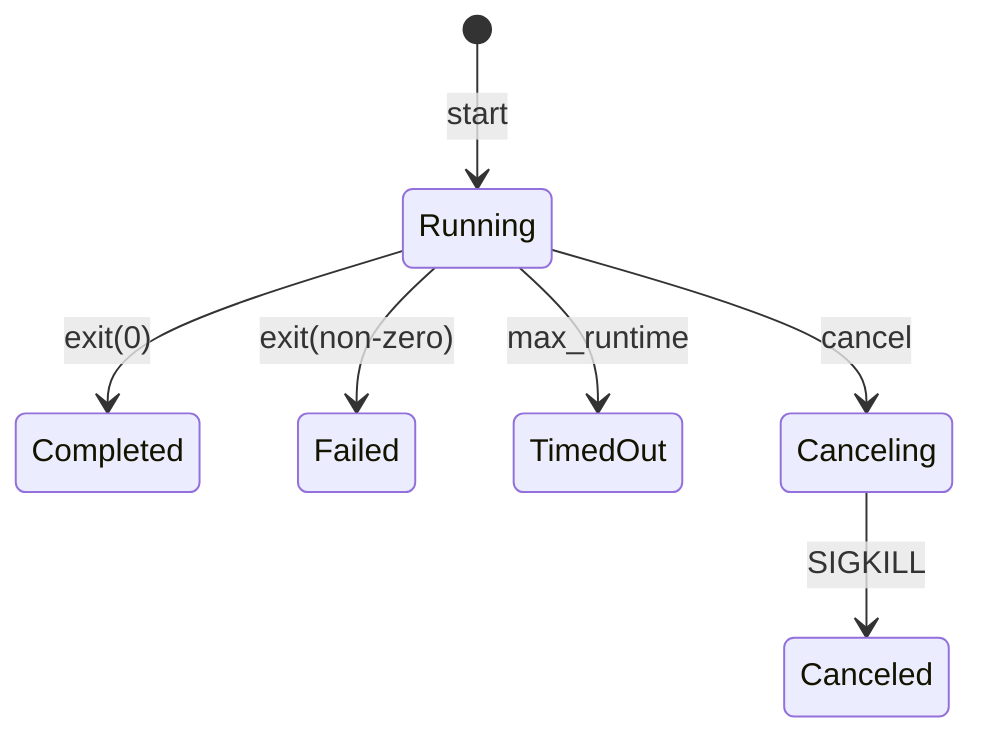

# Tool 模块：细节

> `backend/internal/tool`

> 本文档包含原技术规格的第 1/2/4/5 章；第 3 章（流程与可视化）见 [设计](02-design.md)。

---

## 1. API & Interface Contract

### 1.1 Handler 接口

```go
// Handler 执行工具并返回结果
type Handler func(ctx context.Context, raw json.RawMessage) (any, error)

// Definition 工具定义
type Definition struct {
    ID      string      // 唯一标识: bash, edit, glob, ...
    Spec    llm.Tool    // LLM 工具规格 (OpenAI function calling 格式)
    Handler Handler     // 执行函数
}
```

### 1.2 注册表 API

```go
// All 返回所有工具 (按 ID 排序)
func All() []Definition

// Mount 按 ID 列表挂载工具
func Mount(ids []string) ([]Definition, error)

// ToolsForLLM 转换为 LLM 工具格式
func ToolsForLLM(defs []Definition) []llm.Tool

// Infos 返回工具元信息
func Infos() []Info
```

### 1.3 注册的工具

| ID | 名称 | 描述 | 代码行数 |
|----|------|------|---------|
| `bash` | bash | 同步执行 bash 命令 (带超时) | 86 |
| `run_command` | run_command | 异步执行 bash (start/poll/cancel) | 201 |
| `edit` | edit | 模糊替换编辑 (SBE) | 233 |
| `multiedit` | multiedit | 批量模糊替换 (edit 别名) | 55 |
| `write_file` | write_file | 创建/覆盖/追加文件 | 219 |
| `glob` | glob | 文件路径模式匹配 | 247 |
| `ls` | ls | 列出目录内容 | 119 |
| `search` | search | Web 搜索 (Bocha) | 142 |

---

## 2. 工具详细规格

### 2.1 bash 工具

```json
{
    "command": "String (Required) - bash 命令",
    "timeout_ms": "Integer (Optional) - 超时毫秒"
}

Response: {
    "shell": "String - shell 路径",
    "stdout": "String - 标准输出",
    "stderr": "String - 错误输出",
    "exit_code": "Integer",
    "duration_ms": "Integer",
    "timed_out": "Boolean",
    "stdout_truncated": "Boolean",
    "stderr_truncated": "Boolean"
}
```

**安全限制**:
- 禁止 heredoc (`<<`)
- 禁止 shell 展开 (`$`, `` ` ``)
- 路径必须在 `$BASH_ROOT_DIR` 内

---

### 2.2 run_command 工具 (异步执行)

**action=start**:
```json
Request: {
    "action": "start",
    "command": "String (Required)",
    "wait_seconds": "Integer (0-30, Optional)",
    "max_runtime_seconds": "Integer (1-1800, Default: 600)"
}

Response: {
    "job_id": "uuid",
    "status": "running | completed | failed | timed_out",
    "stdout_delta": "String - 输出增量",
    "stderr_delta": "String",
    "stdout_offset": "Integer - 下次拉取偏移",
    "stderr_offset": "Integer",
    "elapsed_ms": "Integer"
}
```

**action=poll**:
```json
Request: {
    "action": "poll",
    "job_id": "String (Required)",
    "wait_seconds": "Integer (0-30)",
    "stdout_offset": "Integer",
    "stderr_offset": "Integer",
    "max_delta_bytes": "Integer (1-65536, Default: 16384)"
}
```

**action=cancel**:
```json
Request: {
    "action": "cancel",
    "job_id": "String (Required)"
}
```

**状态机**:


---

### 2.3 edit 工具 (模糊替换)

```json
Request: {
    "edits": [{
        "filePath": "String (Required)",
        "oldString": "String (Required, ≤3000 字)",
        "newString": "String (Required, ≤3000 字)",
        "replaceAll": "Boolean (Optional)"
    }],
    "replaceAll": "Boolean (Optional, 全局)"
}

Response: {
    "file_path": "String",
    "replacements": "Integer",
    "files": [{
        "file_path": "String",
        "replacements": "Integer"
    }]
}
```

**限制常量**:

| 常量 | 值 | 说明 |
|------|---|------|
| `maxEditOpsPerCall` | 10 | 单次最大操作数 |
| `maxEditSnippetRunes` | 3000 | 单段最大字符数 |
| `maxEditTotalRunesPerCall` | 12000 | 单次总字符上限 |

---

### 2.4 write_file 工具

```json
Request: {
    "filePath": "String (Required)",
    "content": "String (Required, 建议 ≤3000 字)",
    "append": "Boolean (Optional, Default: false)"
}

Response: {
    "ok": true,
    "file_path": "String",
    "mode": "overwrite | append",
    "written_bytes": "Integer",
    "written_lines": "Integer",
    "total_bytes": "Integer",
    "total_lines": "Integer",
    "truncated": "Boolean - 内容被截断",
    "original_runes": "Integer - 原始字符数",
    "written_runes": "Integer - 实际写入字符数",
    "continue_append": "Boolean - 需继续追加"
}
```

**截断行为**: 超过 `maxWriteFileRunesPerCall` 时自动在换行符处截断，设置 `truncated=true` 和 `continue_append=true` 提示用户继续。

---

### 2.5 glob 工具

```json
Request: {
    "pattern": "String (Required, e.g. **/*.go)"
}

Response: {
    "root": "String - 沙箱根目录",
    "pattern": "String",
    "matches": ["String - 绝对路径"]
}
```

**模式支持**:
- `*` 匹配单层任意字符
- `**` 匹配任意深度目录
- `?` 匹配单字符
- `[abc]` 字符类

---

### 2.6 ls 工具

```json
Request: {
    "path": "String (Optional, Default: '.')"
}

Response: {
    "path": "String",
    "entries": [{
        "name": "String",
        "is_dir": "Boolean",
        "size": "Integer"
    }]
}
```

---

### 2.7 search 工具 (Bocha)

```json
Request: {
    "query": "String (Required)",
    "count": "Integer (1-50, Default: 10)",
    "freshness": "Enum[noLimit, oneDay, oneWeek, oneMonth, oneYear]"
}

Response: SearchResponse from Bocha API
```

**配置来源**: 从 `user_settings` 表读取 `bocha_api_key`。

---

## 4. Sad Path Matrix

| 场景 | 工具 | 错误消息 | 处理 |
|------|------|---------|------|
| **命令为空** | bash, run_command | `command is required` | 拒绝 |
| **命令超时** | bash | 返回 `timed_out=true` | 部分输出 |
| **路径逃逸** | 所有 | `path is outside sandbox root` | 拒绝 |
| **文件不存在** | edit | `文件不存在，请先用 write_file 创建` | 拒绝 |
| **内容过长** | edit, write_file | `过长，请分段` | 拒绝/截断 |
| **匹配失败** | edit | SBE 返回 nil | 拒绝 |
| **工具 ID 无效** | Mount | `unknown tool id` | 拒绝 |
| **JSON 解析失败** | 所有 | 解析错误 | 拒绝 |
| **输出截断** | bash, run_command | 设置 `*_truncated=true` | 警告 |
| **任务不存在** | run_command | `job not found` | 拒绝 |
| **API Key 缺失** | search | `API key not configured` | 拒绝 |

---

## 5. Data Persistence

Tool 模块不直接持久化。失败可通过 `FailureRecorder` 回调记录。

### 5.1 工具配置常量

```go
const (
    maxEditOpsPerCall          = 10
    maxEditSnippetRunes        = 3000
    maxEditTotalRunesPerCall   = 12000
    maxWriteFileRunesPerCall   = 3000
    maxWriteFilePathRunesLimit = 500
)
```

### 5.2 用户设置读取

```go
// search 工具读取 API Key
apiKey := model.GetUserSetting(db, userID, model.SettingKeyBochaAPIKey)
```

