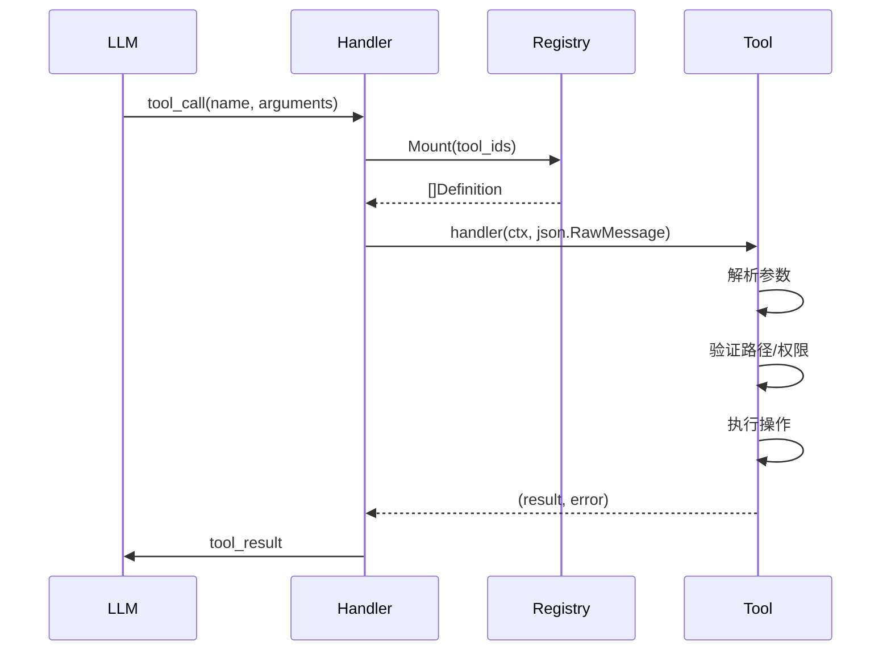

# Tool 模块：设计

> `backend/internal/tool`

> 本文档包含原技术规格的第 3 章（流程与可视化）；其余章节见 [细节](01-details.md)。

---

## 3. Logic Flow & Visualization

### 3.1 工具调用流程



### 3.2 路径安全验证

```go
func resolvePathWithinRoot(root, path string) (string, error) {
    // 1. 清理路径 (Clean)
    // 2. 转为绝对路径
    // 3. 检查相对于 root 是否以 ".." 开头
    // 4. 拒绝任何逃逸 root 的路径
}
```

### 3.3 Context 用户注入

```go
// 注入用户 ID 到 context (供工具读取用户配置)
ctx = tool.ContextWithUserID(ctx, userID)

// 工具内部读取
userID := tool.UserIDFromContext(ctx)
```

