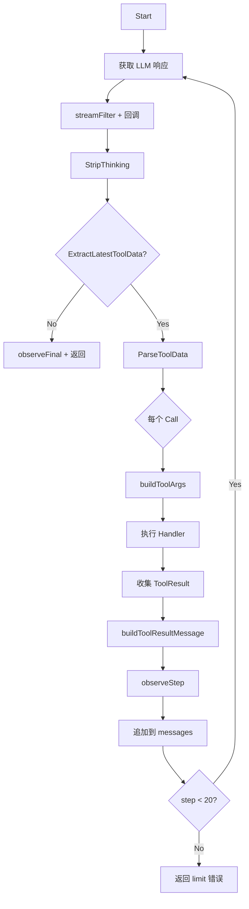
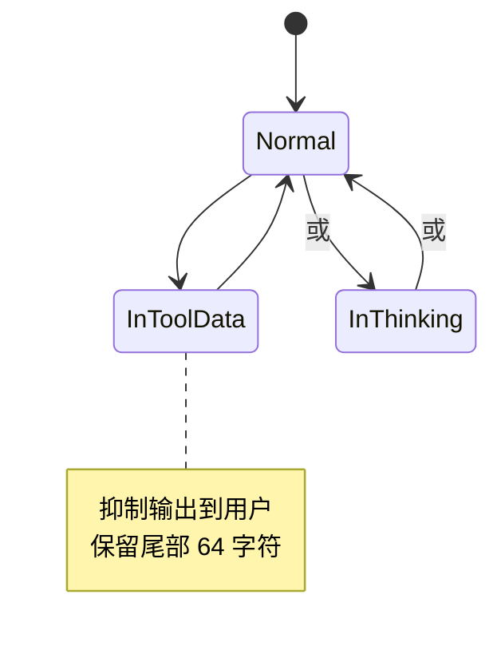

# ToolXML 模块技术规格

> `backend/internal/toolxml` - XML 格式工具调用解析引擎，支持流式处理和 thinking 过滤。

**代码规模**: ~1590 行 | **核心文件**: `engine.go` (537), `parser.go` (271), `stream_filter.go` (177), `prompt.go` (110)

---

## 1. API & Interface Contract

### 1.1 RunLoop 主入口

```go
func RunLoop(
    ctx context.Context,
    client llm.Client,             // LLM 客户端
    messages []llm.ChatMessage,    // 对话历史
    opts *llm.ChatCompletionOptions,
    defs []tool.Definition,        // 可用工具定义
    userID string,                 // 用户 ID (注入 context)
    onContent llm.StreamCallback,   // 可见内容回调
    onTrace func(string),          // 调试追踪
    onError func(string),          // 错误回调
    recordFailure FailureRecorder, // 失败记录器
    observeStep StepObserver,      // 每步观察回调
    observeFinal func(visible, assistant string), // 最终回调
    onStepStart func(step int),    // 步骤开始回调
) (string, error)
```

### 1.2 XML 协议格式

**工具调用请求**:
```xml
<tool_data>
  <call>
    <tool_name>bash</tool_name>
    <command>ls -la</command>
    <timeout_ms>10000</timeout_ms>
  </call>
  <call>
    <tool_name>edit</tool_name>
    <filePath>main.go</filePath>
    <oldcontent>func old()</oldcontent>
    <newcontent>func new()</newcontent>
  </call>
</tool_data>
```

**工具调用响应**:
```xml
<tool_result>
  <call>
    <tool_name>bash</tool_name>
    <tool_call_id>xml_0_0</tool_call_id>
    <ok>true</ok>
    <output><![CDATA[{"stdout":"...","exit_code":0}]]></output>
    <error></error>
  </call>
</tool_result>
```

### 1.3 Call 解析结构

```go
type Call struct {
    ToolName string            // 工具名称
    Fields   map[string]string // 字段 (已归一化)
    Raw      string            // 原始 XML
}
```

---

## 2. 支持的 XML 字段

### 2.1 字段别名归一化

| 标准字段 | 别名 |
|---------|------|
| `filePath` | `file_path` |
| `replaceAll` | `replace_all` |
| `job_id` | `jobId` |
| `wait_seconds` | `waitSeconds`, `wait_ms`, `waitMs` |
| `max_runtime_seconds` | `maxRuntimeSeconds`, `max_runtime_ms`, `maxRuntimeMs` |
| `stdout_offset` | `stdoutOffset` |
| `stderr_offset` | `stderrOffset` |
| `max_delta_bytes` | `maxDeltaBytes` |

### 2.2 按工具的字段转换

| 工具 | 输入字段 | 转换逻辑 |
|------|---------|---------|
| `bash` | `command`, `timeout_ms` | 直接映射 |
| `run_command` | `action`, `command`, `job_id`, `wait_seconds`, `max_runtime_seconds`, ... | 自动推断 action |
| `edit` | `filePath`, `oldcontent`, `newcontent`, `replaceAll` | 构建 edits 数组 |
| `write_file` | `filePath`, `content`, `append` | 直接映射 |
| `glob` | `pattern` | 直接映射 |
| `ls` | `path` | 直接映射 |
| `search` | `query`, `count`, `freshness` | 直接映射 |
| `multiedit` | `edits` (JSON), `replaceAll` | 解析 JSON 数组 |

---

## 3. Logic Flow & Visualization

### 3.1 RunLoop 执行流程



### 3.2 StreamFilter 状态机



### 3.3 Parser 流程

```go
// 1. 提取最后一个 <tool_data>
block, ok := ExtractLatestToolData(rawResponse)

// 2. 解析所有 <call> 块
calls, err := ParseToolData(block)

// 3. 每个 Call 包含:
//    - ToolName (从 tool_name/tool/name 提取)
//    - Fields (支持 CDATA, HTML unescape)
//    - Raw (原始 XML 用于调试)
```

---

## 4. Sad Path Matrix

| 场景 | 错误类型 | 处理策略 | 客户端表现 |
|------|---------|---------|-----------|
| **XML 解析失败** | ParseError | 返回错误，停止循环 | 显示解析错误 |
| **缺少 tool_name** | ParseError | 返回 "missing \<tool_name\>" | 解析错误 |
| **工具不存在** | UnknownTool | recordFailure + error JSON | 继续下一个工具 |
| **参数构建失败** | ArgsError | recordFailure + error JSON | 显示参数错误 |
| **Handler 执行失败** | ExecutionError | recordFailure + 包装为 error payload | 继续循环 |
| **超过 20 轮** | LimitReached | 返回 "xml tool call limit reached" | 显示步数警告 |
| **thinking 未闭合** | Streaming | Flush 丢弃未完成内容 | 静默处理 |
| **tool_data 截断** | Streaming | 保留尾部等待完整 | 静默等待 |
| **CDATA 格式错误** | Tolerant | 容错处理，截取可用部分 | 尽量恢复 |
| **edit 使用旧语法** | Validation | 返回明确错误提示用新语法 | 提示用户 |

---

## 5. Data Persistence

ToolXML 不直接持久化。通过回调记录：

### 5.1 StepRecord 结构

```go
type StepRecord struct {
    VisibleContent    string          // 用户可见文本 (thinking/tool_data 已过滤)
    AssistantContent  string          // 完整助手响应 (thinking 已剥离)
    ToolCalls         []llm.ToolCall  // 工具调用记录
    ToolResults       []ToolResult    // 工具执行结果
    ToolResultMessage string          // 发送给 LLM 的结果 XML
}
```

### 5.2 ToolResult 结构

```go
type ToolResult struct {
    ToolName   string // 工具名称
    ToolCallID string // 调用 ID (xml_{step}_{index})
    OK         bool   // 执行成功
    OutputJSON string // JSON 格式输出
    Error      string // 错误信息
}
```

### 5.3 配置常量

| 常量 | 值 | 用途 |
|------|---|------|
| `maxSteps` | 20 | 最大循环次数 |
| `maxSuppressedTail` | 64 | 抑制态保留尾部字符 |
| `maxSearchTail` | 16 | 搜索态保留尾部字符 |
