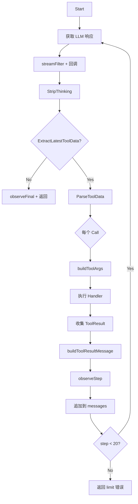
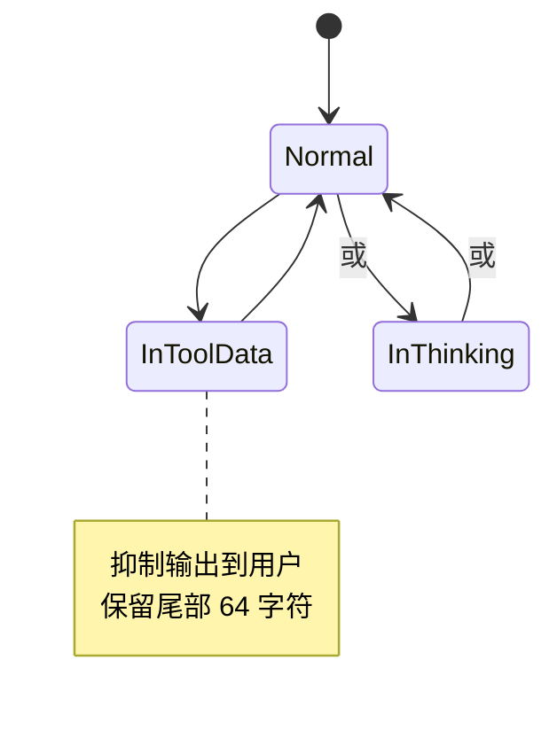

# ToolXML 模块：设计

> `backend/internal/toolxml`

> 本文档包含原技术规格的第 3 章（流程与可视化）；其余章节见 [细节](01-details.md)。

---

## 3. Logic Flow & Visualization

### 3.1 RunLoop 执行流程



### 3.2 StreamFilter 状态机



### 3.3 Parser 流程

```go
// 1. 提取最后一个 <tool_data>
block, ok := ExtractLatestToolData(rawResponse)

// 2. 解析所有 <call> 块
calls, err := ParseToolData(block)

// 3. 每个 Call 包含:
//    - ToolName (从 tool_name/tool/name 提取)
//    - Fields (支持 CDATA, HTML unescape)
//    - Raw (原始 XML 用于调试)
```

