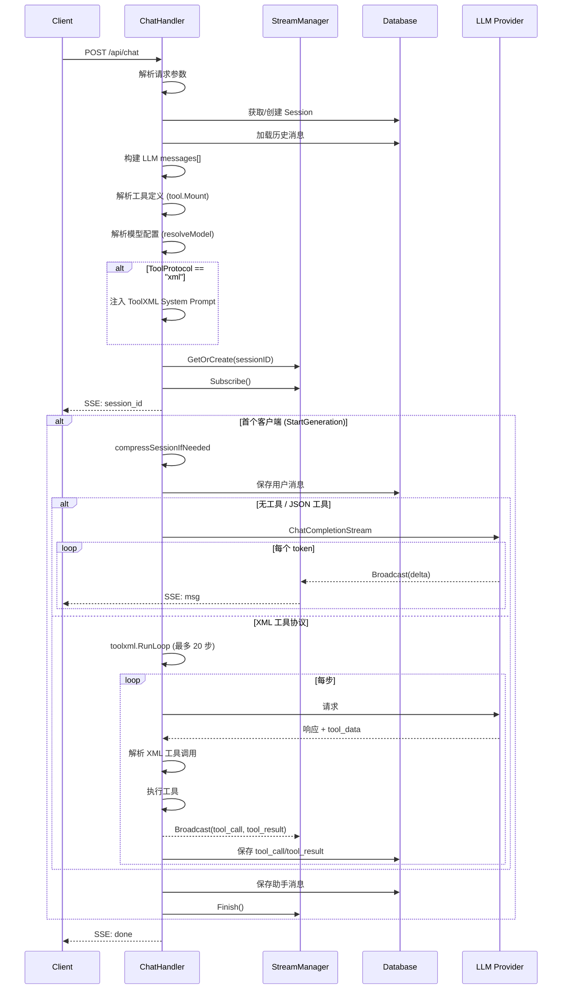
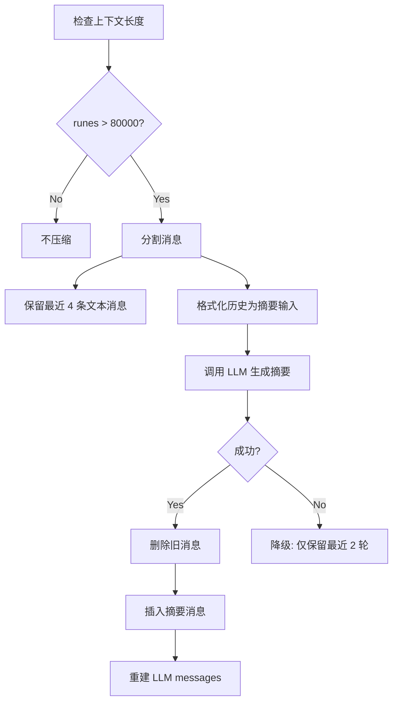
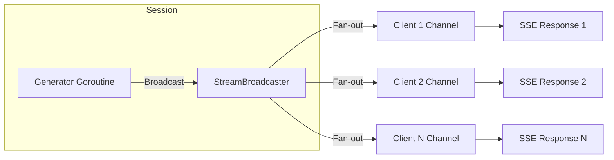

# Handler 模块技术规格

> `backend/internal/handler` - HTTP API 处理器，包含 Chat、Session、Provider/Model CRUD、OAuth 端点。

**代码规模**: ~2900 行 | **核心文件**: `chat.go` (1698), `llm_provider.go` (432), `session_compress.go` (268)

---

## 1. API & Interface Contract

### 1.1 Chat Streaming API

```
POST /api/chat
Content-Type: application/json
Authorization: Bearer <jwt>

Request: {
    "message": "String (Required) - 用户消息内容",
    "session_id": "String (Optional) - 会话ID，为空则自动创建",
    "system_prompt": "String (Optional) - 自定义系统提示词",
    "model_id": "String (Optional) - 指定模型ID",
    "tool_ids": ["String"] (Optional) - 启用的工具ID列表",
    "tool_protocol": "Enum[json, xml] (Optional, Default: json) - 工具调用协议"
}

Response: SSE Stream (text/event-stream)
```

**SSE 事件类型**:

| 事件类型 | 数据格式 | 描述 |
|---------|---------|------|
| `session` | `string` | 会话 ID |
| `msg` | `streamMsg` JSON | 消息增量/状态 |
| `trace` | `string` | 调试追踪信息 |
| `usage` | `{"response_tokens": int}` | Token 使用统计 |
| `error` | `string` | 错误信息 |
| `done` | `""` | 流结束标记 |

**streamMsg 结构**:

```typescript
interface streamMsg {
    op: "start" | "delta" | "final" | "insert";
    id: string;                    // 消息 UUID
    role: "assistant" | "user";
    msg_type: "text" | "tool_call" | "tool_result";
    delta?: string;                // 增量内容 (op=delta)
    error?: string;                // 错误信息 (op=final)
    tool_call?: {                  // 工具调用详情
        protocol: "json" | "xml";
        content: string;
        llm_content: string;
        tool_calls: ToolCall[];
    };
    tool_result?: {               // 工具执行结果
        protocol: "json" | "xml";
        content: string;
        results: ToolResult[];
    };
}
```

---

### 1.2 Session Management API

```
GET /api/sessions
→ 200: ChatSession[]

GET /api/sessions/:id
→ 200: ChatSession with messages[]
→ 404: {"error": "Session not found"}

DELETE /api/sessions/:id
→ 204: No Content
→ 404: {"error": "Session not found"}

POST /api/sessions/:id/truncate
Request: {"from_message_id": Integer (Required)}
→ 200: {"message": "Truncated messages from ID ..."}
→ 404: {"error": "Session not found"}
```

---

### 1.3 LLM Provider/Model API

**Provider CRUD**:

```
GET /api/llm/providers
→ 200: providerResponse[]

POST /api/llm/providers
Request: {
    "name": "String (Required)",
    "provider_type": "Enum[openai, openai_response, claude, openrouter, 
                          bedrock, deepseek, zhipuai, minimax, 
                          antigravity, codex] (Required)",
    "base_url": "String (Required)",
    "api_key": "String (Required)"
}
→ 201: providerResponse

PUT /api/llm/providers/:id
Request: {
    "name": "String (Optional)",
    "provider_type": "String (Optional)",
    "base_url": "String (Optional)",
    "api_key": "String (Optional)"
}
→ 200: providerResponse

DELETE /api/llm/providers/:id
→ 204: No Content
```

**Model CRUD**:

```
GET /api/llm/models?provider_id=<uuid>
→ 200: modelResponse[]

POST /api/llm/models
Request: {
    "provider_id": "String (Required)",
    "name": "String (Required) - 显示名称",
    "model": "String (Required) - API 模型标识符",
    "is_default": "Boolean (Optional, Default: false)",
    "enable_kv_cache": "Boolean (Optional, Default: true)"
}
→ 201: modelResponse

PUT /api/llm/models/:id
Request: {
    "name": "String (Optional)",
    "model": "String (Optional)",
    "is_default": "Boolean (Optional)",
    "enable_kv_cache": "Boolean (Optional)"
}
→ 200: modelResponse

DELETE /api/llm/models/:id
→ 204: No Content
```

---

### 1.4 OAuth API

```
GET /api/auth/config
→ 200: {
    "keycloak_url": "String",
    "realm": "String",
    "client_id": "String"
}

POST /api/auth/callback
Request: {
    "code": "String (Required) - OAuth 授权码",
    "redirect_uri": "String (Required)"
}
→ 200: {
    "access_token": "String - 本地 JWT",
    "expires_in": Integer,
    "refresh_token": "String (Optional)",
    "user": {
        "id": "String",
        "username": "String", 
        "email": "String",
        "name": "String"
    }
}
→ 401: {"error": "Token exchange failed", "details": {...}}
```

---

## 2. Logic Flow & Visualization

### 2.1 StreamChat 完整处理流程



### 2.2 会话压缩流程



**压缩常量**:

| 常量 | 值 | 说明 |
|------|---|------|
| `sessionCompressionMaxContextRunes` | 80,000 | 触发压缩阈值 |
| `sessionCompressionKeepTextMsgs` | 4 | 保留最近消息数 |
| `sessionCompressionMaxSummaryInputRunes` | 120,000 | 摘要输入上限 |
| `sessionCompressionMaxMsgRunesForInput` | 4,000 | 单消息截断长度 |

### 2.3 StreamBroadcaster 机制



**关键方法**:
- `GetOrCreate(sessionID)`: 获取或创建会话广播器
- `Subscribe()`: 订阅事件通道
- `Unsubscribe(ch)`: 取消订阅
- `StartGeneration()`: 原子标记生成开始 (仅首个返回 true)
- `Broadcast(event)`: 向所有订阅者发送事件
- `Finish()`: 关闭所有订阅通道

---

## 3. Sad Path Matrix

### 3.1 Chat API 异常

| 场景 | HTTP | 错误消息 | 处理策略 |
|------|------|---------|---------|
| 请求 JSON 无效 | 400 | `error` | 返回解析错误 |
| 工具 ID 不存在 | 400 | `unknown tool id: xxx` | 拒绝请求 |
| 工具协议无效 | 400 | `invalid tool_protocol` | 拒绝请求 |
| 无可用模型 | 400 | `no default model configured` | 提示配置 |
| LLM API 错误 | SSE error | 错误详情 | 广播错误事件 |
| 流式中断 | - | - | Generator 继续，保存结果 |
| 上下文过长 | SSE trace | 压缩提示 | 自动压缩 |
| 压缩失败 | SSE trace | 降级提示 | 仅保留最近 2 轮 |
| 工具执行失败 | SSE msg | `tool_result.error` | 记录失败，继续循环 |
| XML 循环超限 | SSE error | `limit reached` | 强制终止 |

### 3.2 Provider/Model API 异常

| 场景 | HTTP | 错误消息 |
|------|------|---------|
| 数据库不可用 | 503 | `Database not available` |
| Provider 类型不支持 | 400 | `Unsupported provider type` |
| Provider 不存在 | 404 | `Provider not found` |
| Model 不存在 | 404 | `Model not found` |
| 必填字段缺失 | 400 | binding 错误详情 |

### 3.3 OAuth 异常

| 场景 | HTTP | 错误消息 |
|------|------|---------|
| Code 无效 | 401 | `Token exchange failed` |
| Keycloak 不可达 | 500 | `Failed to exchange token` |
| JWT 签发失败 | 500 | `Failed to sign token` |

---

## 4. Data Persistence

### 4.1 工具消息序列化格式

**tool_call 消息 Content**:

```json
{
    "_protocol": "json | xml",
    "_content": "用户可见文本",
    "_llm_content": "完整 LLM 响应",
    "_tool_calls": [
        {
            "id": "call_xxx",
            "type": "function",
            "function": {
                "name": "bash",
                "arguments": "{\"command\":\"ls\"}"
            }
        }
    ]
}
```

**tool_result 消息 Content**:

```json
{
    "_protocol": "json | xml",
    "_name": "bash",
    "_tool_call_id": "call_xxx",
    "_content": "原始响应内容",
    "_results": [
        {
            "tool_name": "bash",
            "tool_call_id": "call_xxx",
            "arguments": "{...}",
            "ok": true,
            "output": "{\"stdout\":\"...\"}",
            "error": ""
        }
    ]
}
```

### 4.2 会话元数据

Session Metadata (`JSONB`) 存储:

```json
{
    "system_prompt": "自定义系统提示",
    "model_id": "选定模型 ID",
    "tool_ids": ["bash", "edit"],
    "tool_protocol": "xml"
}
```

### 4.3 LLM 调用记录

```sql
INSERT INTO llm_calls (session_id, user_id, provider_id, model_id, 
                       model_name, messages, response, error, ...)
```

### 4.4 JWT 配置

| 配置项 | 环境变量 | 默认值 |
|--------|---------|--------|
| 签名密钥 | `JWT_SECRET` | `default-secret-change-me` |
| 有效期 | `JWT_EXPIRE_DAYS` | 7 天 |
| 签发者 | - | `oneAgent-backend` |
