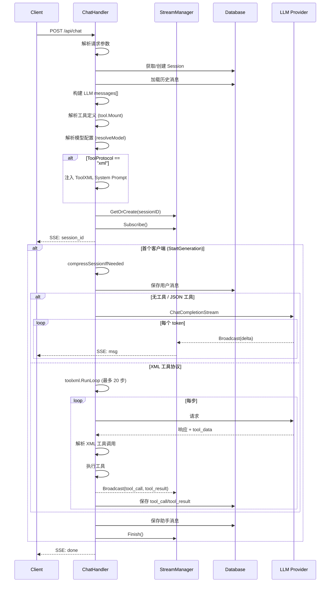
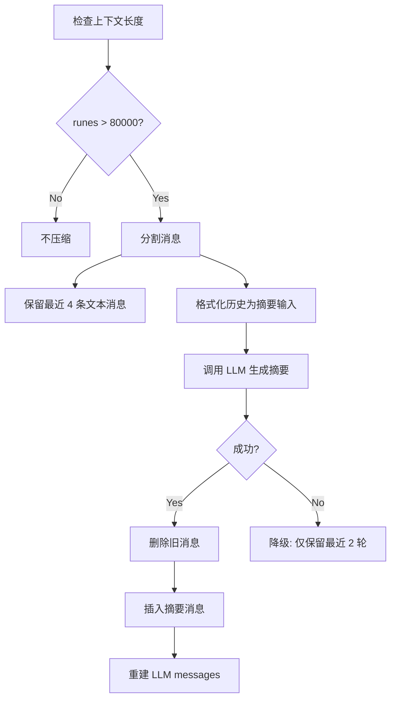
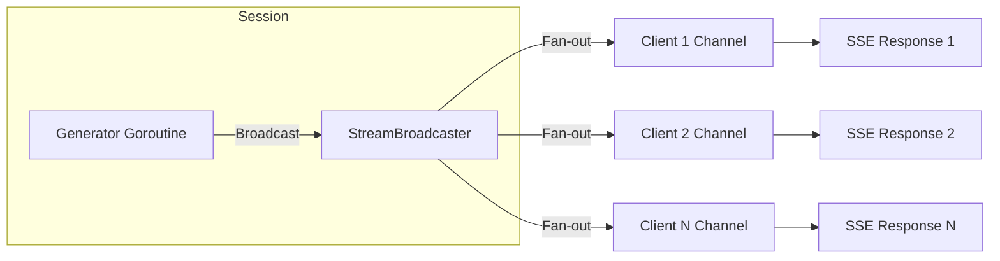

# Handler 模块：设计

> `backend/internal/handler`

> 本文档包含原技术规格的第 2 章（流程与可视化）；其余章节见 [细节](01-details.md)。

---

## 2. Logic Flow & Visualization

### 2.1 StreamChat 完整处理流程

### 2.2 会话压缩流程

**压缩常量**:

| 常量 | 值 | 说明 |
|------|---|------|
| `sessionCompressionMaxContextRunes` | 80,000 | 触发压缩阈值 |
| `sessionCompressionKeepTextMsgs` | 4 | 保留最近消息数 |
| `sessionCompressionMaxSummaryInputRunes` | 120,000 | 摘要输入上限 |
| `sessionCompressionMaxMsgRunesForInput` | 4,000 | 单消息截断长度 |

### 2.3 StreamBroadcaster 机制

**关键方法**:
- `GetOrCreate(sessionID)`: 获取或创建会话广播器
- `Subscribe()`: 订阅事件通道
- `Unsubscribe(ch)`: 取消订阅
- `StartGeneration()`: 原子标记生成开始 (仅首个返回 true)
- `Broadcast(event)`: 向所有订阅者发送事件
- `Finish()`: 关闭所有订阅通道

