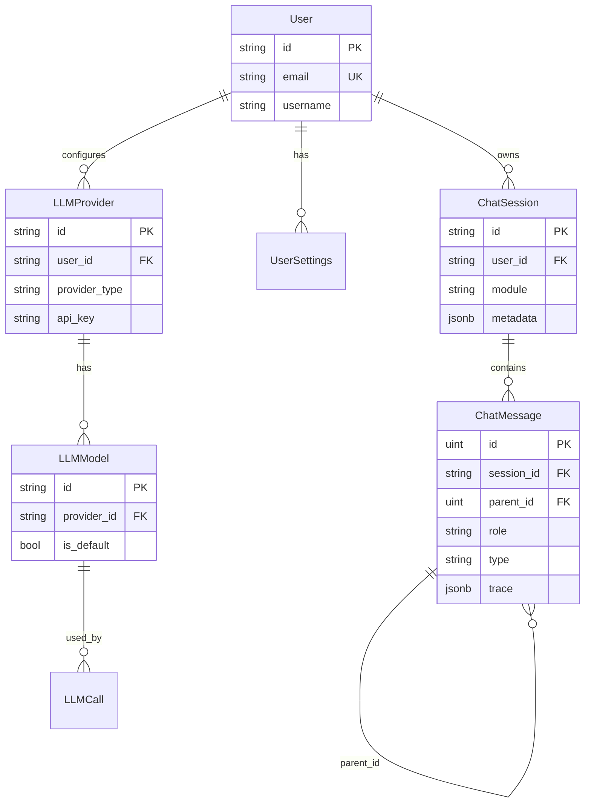
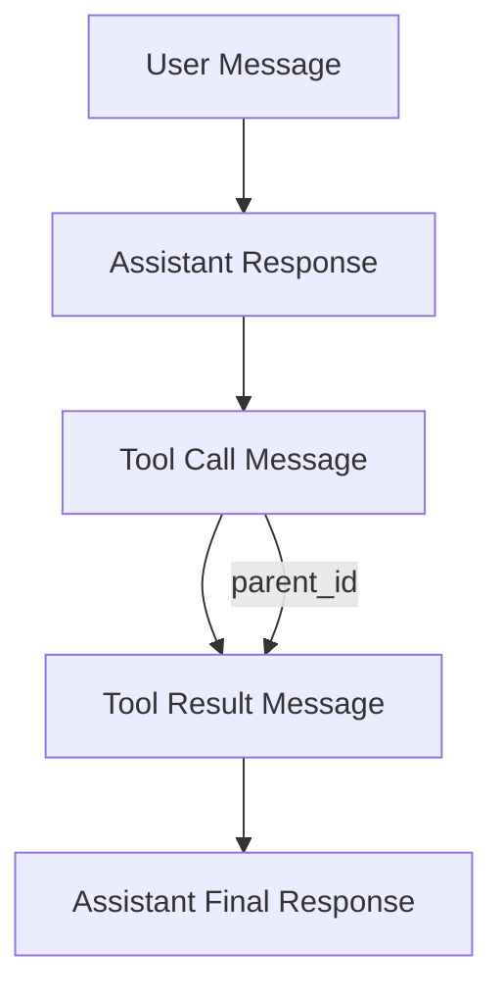

# Model 模块技术规格

> `backend/internal/model` - 数据模型定义，包含用户、会话、消息、LLM 配置和追踪数据结构。

---

## 1. API & Interface Contract

### 数据模型类型定义

#### User (用户模型)

```go
type User struct {
    ID        string         // PK, varchar(255), 来自 OAuth provider
    Email     string         // Unique Index, varchar(255), Required
    Username  string         // varchar(255), Required
    Name      string         // varchar(255), Optional
    CreatedAt time.Time      // Required
    UpdatedAt time.Time      // Required
    DeletedAt gorm.DeletedAt // Soft delete
}
```

#### ChatSession (会话模型)

```go
type ChatSession struct {
    ID        string    // PK, varchar(36), UUID
    UserID    string    // FK → users.id, Required
    Title     string    // varchar(500), Required
    Module    string    // varchar(50), Default: "assistant"
                        // Enum[assistant, reader, guide, custom]
    Metadata  JSONB     // jsonb, Optional, 自定义会话数据
    CreatedAt time.Time
    UpdatedAt time.Time
    DeletedAt gorm.DeletedAt
    
    Messages []ChatMessage // HasMany 关系
}
```

#### ChatMessage (消息模型)

```go
type ChatMessage struct {
    ID        uint      // PK, auto increment
    SessionID string    // FK → chat_sessions.id, Required
    ParentID  *uint     // Optional, 用于工具调用层级
    Role      string    // Enum[user, assistant, system, tool]
    Type      string    // Enum[text, tool_call, tool_result], Default: "text"
    Content   string    // text, Required
    Trace     TraceDataJSON // jsonb, Optional, 追踪数据
    CreatedAt time.Time
    DeletedAt gorm.DeletedAt
    
    Children []ChatMessage // HasMany, 自关联
}
```

#### LLMProvider (LLM 提供商)

```go
type LLMProvider struct {
    ID           string    // PK, varchar(36), UUID
    UserID       string    // FK, Required
    Name         string    // varchar(255), Required
    ProviderType string    // Enum[openai, anthropic, custom]
    BaseURL      string    // varchar(500), Required
    APIKey       string    // text, Required, JSON 隐藏
    CreatedAt    time.Time
    UpdatedAt    time.Time
    DeletedAt    gorm.DeletedAt
    
    Models []LLMModel // HasMany 关系
}
```

#### LLMModel (LLM 模型配置)

```go
type LLMModel struct {
    ID            string // PK, varchar(36)
    ProviderID    string // FK → llm_providers.id
    UserID        string // FK
    Name          string // varchar(255), 显示名称
    Model         string // varchar(255), API 模型标识
    IsDefault     bool   // Default: false
    EnableKVCache bool   // Default: true
    Options       JSONB  // jsonb, 额外参数
    CreatedAt     time.Time
    UpdatedAt     time.Time
    DeletedAt     gorm.DeletedAt
}
```

---

## 2. Logic Flow & Visualization

### 实体关系图



### 消息层级关系



---

## 3. Sad Path Matrix

| 场景 | 异常类型 | 处理策略 | 客户端表现 |
|------|---------|---------|-----------|
| **用户 ID 不存在** | Data Integrity | 自动创建用户记录 (OAuth 首次登录) | 无感知 |
| **会话软删除** | Data Integrity | GORM DeletedAt 过滤，查询自动排除 | 404 Not Found |
| **消息 ParentID 无效** | Referential Integrity | 允许 NULL，不强制外键 | 忽略层级关系 |
| **JSONB 解析失败** | Data Corruption | 返回空结构体，记录错误日志 | 部分功能降级 |
| **Provider APIKey 泄露** | Security | JSON tag `json:"-"` 阻止序列化 | API 响应不含敏感字段 |
| **并发会话更新** | Concurrency | GORM 乐观锁 (UpdatedAt) | 后写入覆盖 |
| **超大 Trace 数据** | Performance | 前端分页加载，后端不限制大小 | 首次加载可能慢 |

---

## 4. Data Persistence

### 数据库表定义

```sql
-- 用户表
CREATE TABLE users (
    id VARCHAR(255) PRIMARY KEY,
    email VARCHAR(255) NOT NULL UNIQUE,
    username VARCHAR(255) NOT NULL,
    name VARCHAR(255),
    created_at TIMESTAMP DEFAULT CURRENT_TIMESTAMP,
    updated_at TIMESTAMP DEFAULT CURRENT_TIMESTAMP,
    deleted_at TIMESTAMP,
    
    INDEX idx_users_deleted (deleted_at)
);

-- 会话表
CREATE TABLE chat_sessions (
    id VARCHAR(36) PRIMARY KEY,
    user_id VARCHAR(255) NOT NULL,
    title VARCHAR(500) NOT NULL,
    module VARCHAR(50) DEFAULT 'assistant',
    metadata JSONB,
    created_at TIMESTAMP DEFAULT CURRENT_TIMESTAMP,
    updated_at TIMESTAMP DEFAULT CURRENT_TIMESTAMP,
    deleted_at TIMESTAMP,
    
    INDEX idx_sessions_user (user_id),
    INDEX idx_sessions_module (module),
    INDEX idx_sessions_deleted (deleted_at)
);

-- 消息表
CREATE TABLE chat_messages (
    id BIGSERIAL PRIMARY KEY,
    session_id VARCHAR(36) NOT NULL,
    parent_id BIGINT,
    role VARCHAR(20) NOT NULL,
    type VARCHAR(20) DEFAULT 'text',
    content TEXT NOT NULL,
    trace JSONB,
    created_at TIMESTAMP DEFAULT CURRENT_TIMESTAMP,
    deleted_at TIMESTAMP,
    
    INDEX idx_messages_session (session_id),
    INDEX idx_messages_parent (parent_id),
    INDEX idx_messages_deleted (deleted_at)
);

-- LLM 提供商表
CREATE TABLE llm_providers (
    id VARCHAR(36) PRIMARY KEY,
    user_id VARCHAR(255) NOT NULL,
    name VARCHAR(255) NOT NULL,
    provider_type VARCHAR(50) NOT NULL,
    base_url VARCHAR(500) NOT NULL,
    api_key TEXT NOT NULL,
    created_at TIMESTAMP DEFAULT CURRENT_TIMESTAMP,
    updated_at TIMESTAMP DEFAULT CURRENT_TIMESTAMP,
    deleted_at TIMESTAMP,
    
    INDEX idx_providers_user (user_id),
    INDEX idx_providers_type (provider_type)
);

-- LLM 模型表
CREATE TABLE llm_models (
    id VARCHAR(36) PRIMARY KEY,
    provider_id VARCHAR(36) NOT NULL,
    user_id VARCHAR(255) NOT NULL,
    name VARCHAR(255) NOT NULL,
    model VARCHAR(255) NOT NULL,
    is_default BOOLEAN DEFAULT FALSE,
    enable_kv_cache BOOLEAN DEFAULT TRUE,
    options JSONB,
    created_at TIMESTAMP DEFAULT CURRENT_TIMESTAMP,
    updated_at TIMESTAMP DEFAULT CURRENT_TIMESTAMP,
    deleted_at TIMESTAMP,
    
    INDEX idx_models_provider (provider_id),
    INDEX idx_models_user (user_id),
    FOREIGN KEY (provider_id) REFERENCES llm_providers(id)
);

-- 用户设置表
CREATE TABLE user_settings (
    id BIGSERIAL PRIMARY KEY,
    user_id VARCHAR(255) NOT NULL,
    key VARCHAR(100) NOT NULL,
    value TEXT NOT NULL,
    created_at TIMESTAMP DEFAULT CURRENT_TIMESTAMP,
    updated_at TIMESTAMP DEFAULT CURRENT_TIMESTAMP,
    deleted_at TIMESTAMP,
    
    UNIQUE (user_id, key)
);
```

### 辅助函数

| 函数 | 签名 | 用途 |
|------|------|------|
| `GetSessionsByModule` | `(db, userID, module) → []ChatSession` | 按模块筛选会话 |
| `GetSessionWithMessages` | `(db, sessionID, userID) → *ChatSession` | 加载会话及消息 |
| `GetUserSetting` | `(db, userID, key) → string` | 读取单个设置 |
| `SetUserSetting` | `(db, userID, key, value) → error` | 创建或更新设置 |
| `GetUserSettingsMap` | `(db, userID) → map[string]any` | 读取所有设置 (隐藏敏感值) |
