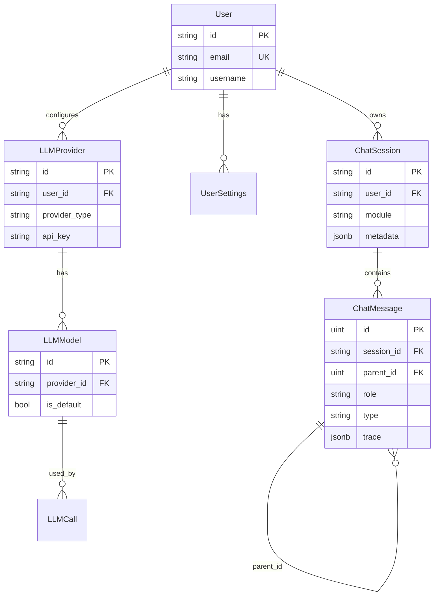
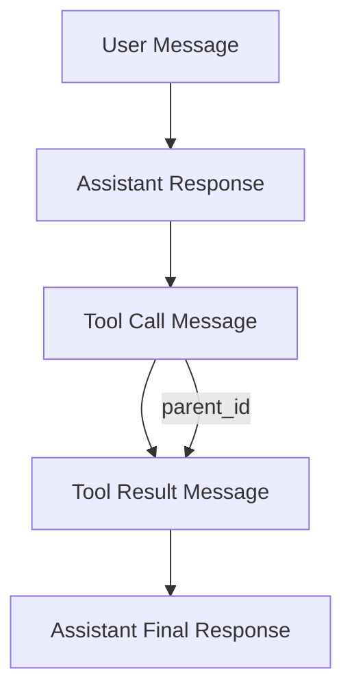

# Model 模块：设计

> `backend/internal/model`

> 本文档包含原技术规格的第 2 章（可视化）；其余章节见 [细节](01-details.md)。

---

## 2. Logic Flow & Visualization

### 实体关系图

```mermaid
erDiagram
    User ||--o{ ChatSession : "owns"
    User ||--o{ UserSettings : "has"
    User ||--o{ LLMProvider : "configures"
    
    ChatSession ||--o{ ChatMessage : "contains"
    ChatMessage ||--o{ ChatMessage : "parent_id"
    
    LLMProvider ||--o{ LLMModel : "has"
    LLMModel ||--o{ LLMCall : "used_by"
    
    User {
        string id PK
        string email UK
        string username
    }
    
    ChatSession {
        string id PK
        string user_id FK
        string module
        jsonb metadata
    }
    
    ChatMessage {
        uint id PK
        string session_id FK
        uint parent_id FK
        string role
        string type
        jsonb trace
    }
    
    LLMProvider {
        string id PK
        string user_id FK
        string provider_type
        string api_key
    }
    
    LLMModel {
        string id PK
        string provider_id FK
        bool is_default
    }
```

### 消息层级关系

```mermaid
flowchart TD
    A[User Message] --> B[Assistant Response]
    B --> C[Tool Call Message]
    C --> D[Tool Result Message]
    D --> E[Assistant Final Response]
    
    C -- parent_id --> D
```

