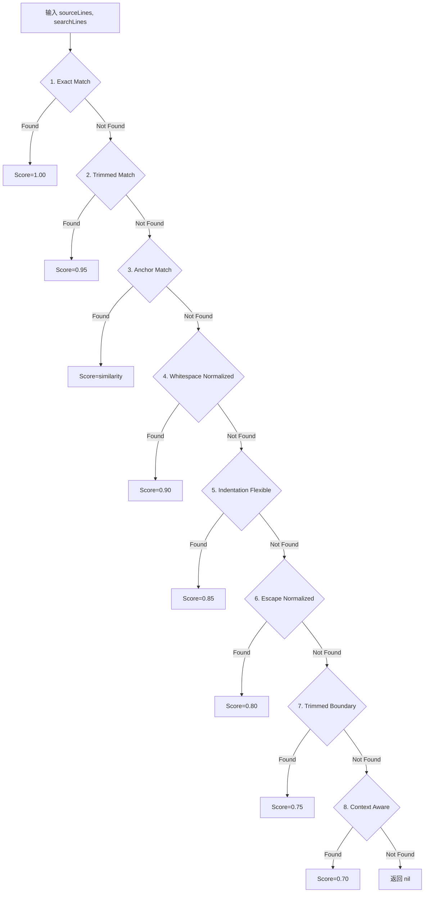
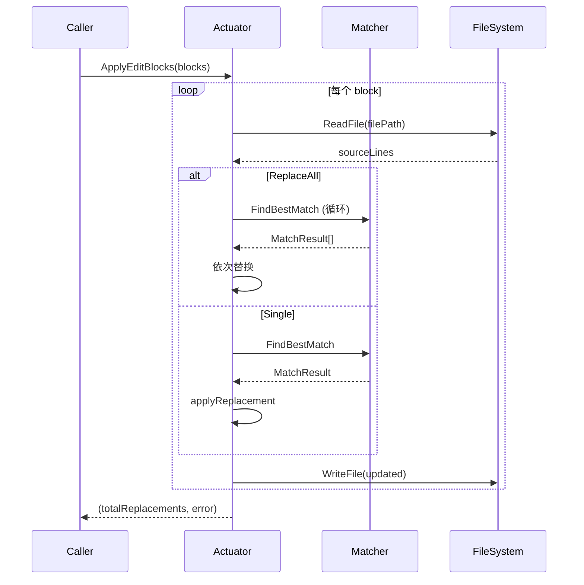

# SBE 模块技术规格

> `backend/internal/sbe` - 智能块编辑器 (Smart Block Editor)，提供 9 层瀑布式模糊匹配算法。

**代码规模**: ~485 行 | **核心文件**: `matcher.go` (314), `actuator.go` (99), `levenshtein.go` (56), `types.go` (16)

---

## 1. API & Interface Contract

### 1.1 核心接口

```go
// FindBestMatch 在源文件中查找搜索块的最佳匹配位置
func FindBestMatch(sourceLines []string, searchLines []string) *MatchResult

// ApplyEditBlocks 应用编辑块列表，返回总替换次数
func ApplyEditBlocks(blocks []EditBlock) (int, error)
```

### 1.2 数据类型

```go
type MatchResult struct {
    StartLine int     // 匹配起始行 (0-indexed)
    EndLine   int     // 匹配结束行 (inclusive)
    Score     float64 // 匹配分数 (0.0-1.0)
}

type EditBlock struct {
    FilePath   string   // 目标文件路径
    Search     []string // 搜索行
    Replace    []string // 替换行
    ReplaceAll bool     // 是否替换所有匹配
}
```

---

## 2. 9 层瀑布匹配算法

### 2.1 算法流程



### 2.2 策略详解

| 层级 | 策略名称 | 匹配逻辑 | 分数 |
|-----|---------|---------|------|
| **1** | Exact Match | 逐行精确字符串比较 | 1.00 |
| **2** | Trimmed Match | `TrimSpace()` 后逐行比较 | 0.95 |
| **3** | Anchor Match | 首尾行精确 + 中间 Levenshtein ≥0.6 | 0.60-0.99 |
| **4** | Whitespace Normalized | 所有空白合并为单空格后比较 | 0.90 |
| **5** | Indentation Flexible | 移除公共缩进后比较 | 0.85 |
| **6** | Escape Normalized | 处理 `\n`, `\t`, `\'`, `\"` 等转义 | 0.80 |
| **7** | Trimmed Boundary | 移除首尾空行后用 Trimmed Match | 0.75 |
| **8** | Context Aware | 首尾锚定 + 中间存在即可 | 0.70 |
| **9** | Multi Occurrence | (预留，当前返回 nil) | - |

### 2.3 Levenshtein 距离

```go
// ComputeDistance 计算两字符串的编辑距离
func ComputeDistance(a, b string) int

// 相似度计算
similarity := 1.0 - (float64(distance) / float64(max(len(a), len(b))))
```

**Anchor Match 阈值**: `SimilarityThreshold = 0.6`

---

## 3. Logic Flow & Visualization

### 3.1 ApplyEditBlocks 流程



### 3.2 Anchor Match 伪码

```python
function findAnchorMatch(source, search):
    if len(search) < 3:
        return nil
    
    firstLine = TrimSpace(search[0])
    lastLine = TrimSpace(search[-1])
    
    for i in range(len(source)):
        if TrimSpace(source[i]) != firstLine:
            continue
        
        maxDist = len(search) * 2
        for j in range(i+1, min(len(source), i+maxDist)):
            if TrimSpace(source[j]) == lastLine:
                sourceBlock = normalize(join(source[i:j+1]))
                searchBlock = normalize(join(search))
                
                distance = ComputeDistance(sourceBlock, searchBlock)
                similarity = 1.0 - (distance / max(len(sourceBlock), len(searchBlock)))
                
                if similarity >= 0.6:
                    return MatchResult(i, j, similarity)
    
    return nil
```

---

## 4. Sad Path Matrix

| 场景 | 函数 | 错误消息 | 处理 |
|------|------|---------|------|
| **空搜索块** | FindBestMatch | 返回 nil | 调用方处理 |
| **文件路径为空** | applyBlock | `file path is required` | 拒绝 |
| **搜索块为空** | applyBlock | `search block is empty for {file}` | 拒绝 |
| **文件读取失败** | applyBlock | `read file error: {err}` | 拒绝 |
| **无匹配** | applyBlock | `could not find search block in {file}` | 拒绝 |
| **文件写入失败** | writeLines | `write file error: {err}` | 拒绝 |
| **相似度过低** | findAnchorMatch | 返回 nil | 尝试下一层 |

---

## 5. Data Persistence

SBE 是纯内存模块，不涉及持久化。

### 5.1 辅助函数

```go
// normalize 移除所有空白用于松散比较
func normalize(s string) string {
    return strings.Join(strings.Fields(s), "")
}
```

### 5.2 转义处理

```go
// unescape 处理常见转义序列
func unescape(input string) string {
    // \n → 换行
    // \t → 制表符
    // \r → 回车
    // \' → 单引号
    // \" → 双引号
    // \` → 反引号
    // \$ → 美元符
    // \\ → 反斜杠
}
```

### 5.3 缩进剥离

```go
// stripIndent 移除所有行的公共缩进前缀
func stripIndent(lines []string) string {
    // 1. 找到非空行的最小缩进
    // 2. 从每行移除该缩进长度
    // 3. 拼接返回
}
```
