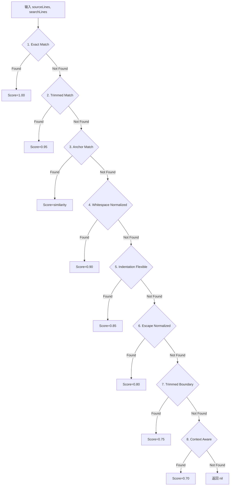
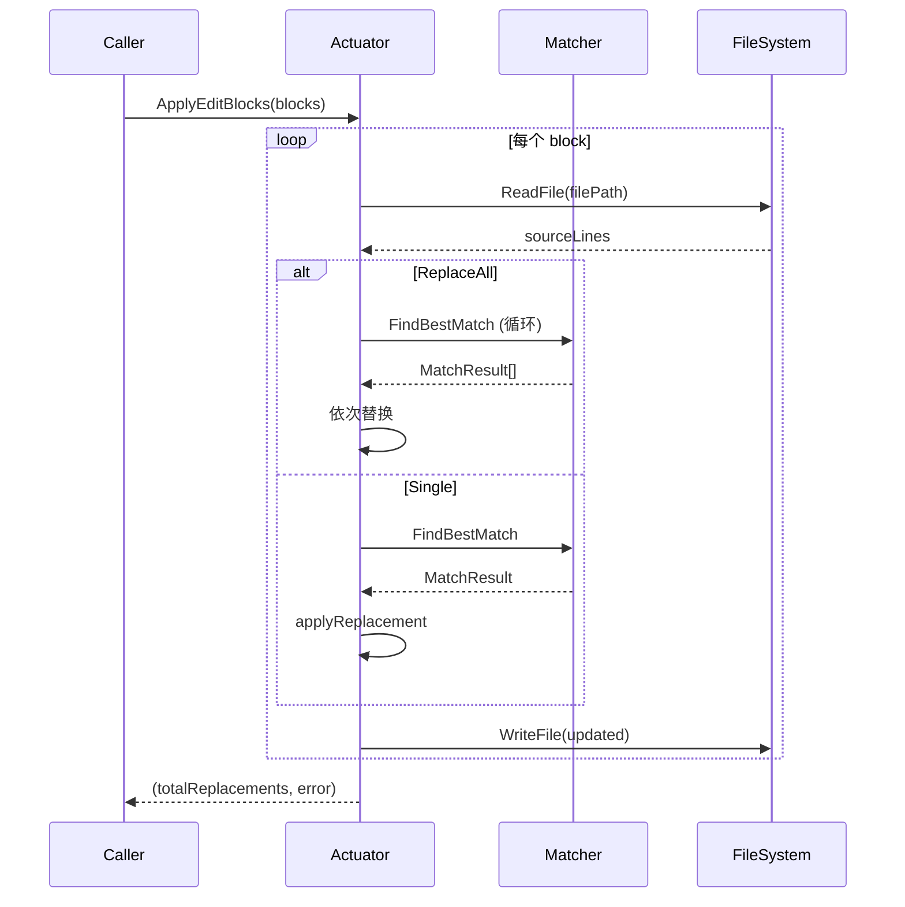

# SBE 模块：设计

> `backend/internal/sbe`

> 本文档包含原技术规格的第 2/3 章（算法与流程）；其余章节见 [细节](01-details.md)。

---

## 2. 9 层瀑布匹配算法

### 2.1 算法流程



### 2.2 策略详解

| 层级 | 策略名称 | 匹配逻辑 | 分数 |
|-----|---------|---------|------|
| **1** | Exact Match | 逐行精确字符串比较 | 1.00 |
| **2** | Trimmed Match | `TrimSpace()` 后逐行比较 | 0.95 |
| **3** | Anchor Match | 首尾行精确 + 中间 Levenshtein ≥0.6 | 0.60-0.99 |
| **4** | Whitespace Normalized | 所有空白合并为单空格后比较 | 0.90 |
| **5** | Indentation Flexible | 移除公共缩进后比较 | 0.85 |
| **6** | Escape Normalized | 处理 `\n`, `\t`, `\'`, `\"` 等转义 | 0.80 |
| **7** | Trimmed Boundary | 移除首尾空行后用 Trimmed Match | 0.75 |
| **8** | Context Aware | 首尾锚定 + 中间存在即可 | 0.70 |
| **9** | Multi Occurrence | (预留，当前返回 nil) | - |

### 2.3 Levenshtein 距离

```go
// ComputeDistance 计算两字符串的编辑距离
func ComputeDistance(a, b string) int

// 相似度计算
similarity := 1.0 - (float64(distance) / float64(max(len(a), len(b))))
```

**Anchor Match 阈值**: `SimilarityThreshold = 0.6`

---

## 3. Logic Flow & Visualization

### 3.1 ApplyEditBlocks 流程



### 3.2 Anchor Match 伪码

```python
function findAnchorMatch(source, search):
    if len(search) < 3:
        return nil
    
    firstLine = TrimSpace(search[0])
    lastLine = TrimSpace(search[-1])
    
    for i in range(len(source)):
        if TrimSpace(source[i]) != firstLine:
            continue
        
        maxDist = len(search) * 2
        for j in range(i+1, min(len(source), i+maxDist)):
            if TrimSpace(source[j]) == lastLine:
                sourceBlock = normalize(join(source[i:j+1]))
                searchBlock = normalize(join(search))
                
                distance = ComputeDistance(sourceBlock, searchBlock)
                similarity = 1.0 - (distance / max(len(sourceBlock), len(searchBlock)))
                
                if similarity >= 0.6:
                    return MatchResult(i, j, similarity)
    
    return nil
```

