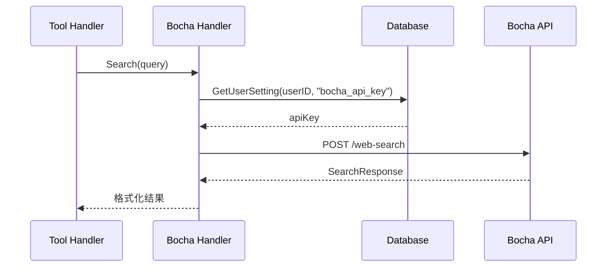

# Bocha 模块：设计

> `backend/internal/bocha`

> 本文档包含原技术规格的第 2 章（流程与可视化）；其余章节见 [细节](01-details.md)。

---

## 2. Logic Flow & Visualization

### 搜索流程

### 新鲜度选项

| 值 | 含义 |
|---|------|
| `noLimit` | 不限时间 |
| `oneDay` | 过去 24 小时 |
| `oneWeek` | 过去一周 |
| `oneMonth` | 过去一月 |
| `oneYear` | 过去一年 |

