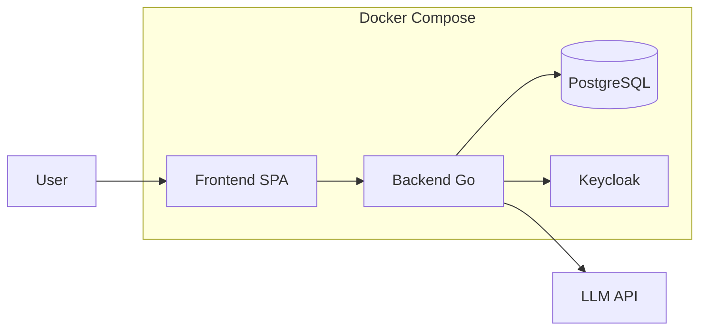

# 部署指南

> Docker Compose 多服务部署

---

## 1. 服务架构



---

## 2. 快速启动

```bash
# 克隆仓库
git clone <repo> && cd oneAgent

# 复制环境变量
cp .env.example .env
# 编辑 .env 配置

# 启动所有服务
docker-compose up --build

# 访问
# App: http://localhost:8080
# Keycloak: http://localhost:8180
```

---

## 3. 环境变量

| 变量 | 描述 | 默认值 |
|------|------|--------|
| `PORT` | 后端端口 | `8080` |
| `DATABASE_URL` | PostgreSQL 连接串 | - |
| `KEYCLOAK_URL` | Keycloak 地址 | - |
| `KEYCLOAK_REALM` | Keycloak Realm | `base-realm` |
| `KEYCLOAK_CLIENT_ID` | Client ID | `base-app` |
| `KEYCLOAK_CLIENT_SECRET` | Client Secret | - |
| `JWT_SECRET` | JWT 签名密钥 | - |
| `JWT_EXPIRE_DAYS` | JWT 有效期 (天) | `7` |
| `BASH_ROOT_DIR` | 工具沙箱目录 | - |
| `ENABLE_TRACE` | 启用调试追踪 | `false` |

---

## 4. Keycloak 配置

### 首次设置

1. 访问 `http://localhost:8180`
2. 登录 `admin` / `admin123`
3. 创建 Realm: `base-realm`
4. 创建 Client: `base-app`
   - Client Protocol: `openid-connect`
   - Access Type: `public`
   - Valid Redirect URIs: `http://localhost:8080/*`
   - Web Origins: `http://localhost:8080`
5. 创建测试用户

---

## 5. Docker Compose 服务

```yaml
services:
  app:
    build: .
    ports:
      - "8080:8080"
    environment:
      - DATABASE_URL
      - KEYCLOAK_URL
    depends_on:
      - postgres
      - keycloak

  postgres:
    image: postgres:16
    environment:
      - POSTGRES_DB
      - POSTGRES_USER
      - POSTGRES_PASSWORD
    volumes:
      - postgres_data:/var/lib/postgresql/data

  keycloak:
    image: quay.io/keycloak/keycloak:24
    ports:
      - "8180:8080"
```

---

## 6. 生产部署

建议：
- 使用外部 PostgreSQL 服务
- 使用托管 Keycloak 或其他 OIDC 提供商
- 配置 HTTPS 和反向代理
- 设置健康检查 (`/health`)
