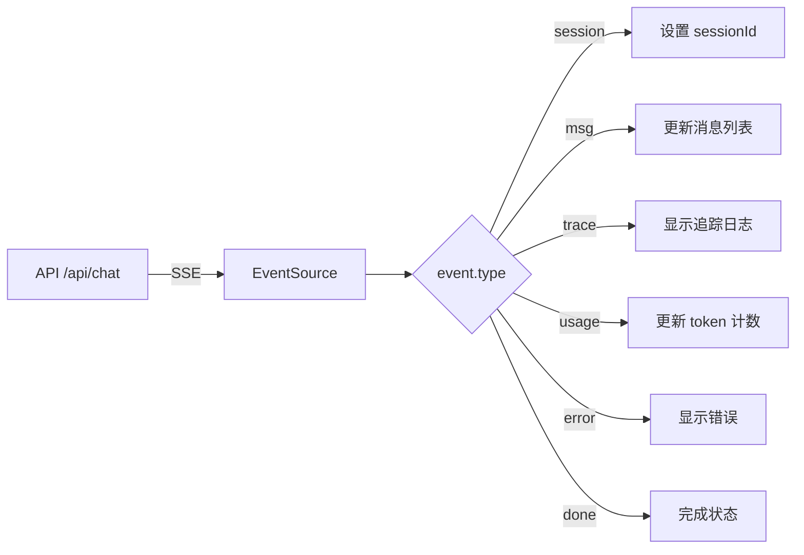

# 前端架构技术规格

> `frontend/src` - Vue 3 + TypeScript SPA 架构

---

## 1. 技术栈

| 技术 | 版本 | 用途 |
|------|------|------|
| Vue 3 | ^3.x | 响应式 UI 框架 |
| TypeScript | ^5.x | 类型安全 |
| Vite | ^5.x | 构建工具 |
| Tailwind CSS | ^3.x | 样式系统 |
| Pinia | ^2.x | 状态管理 |
| Vue Router | ^4.x | 路由 |
| ofetch | - | HTTP 客户端 |

---

## 2. 目录结构

```
frontend/src/
├── api/
│   └── client.ts        # API 客户端 (ofetch + SSE)
├── components/
│   ├── ChatBox.vue      # 聊天输入/消息显示
│   ├── ChatHistoryList.vue  # 历史会话列表
│   ├── Sidebar.vue      # 侧边栏导航
│   ├── ThinkingProcess.vue  # 思考过程展示
│   ├── ToolMessage.vue  # 工具调用/结果消息
│   ├── TraceLog.vue     # 追踪日志
│   └── Welcome.vue      # 欢迎页面
├── composables/         # Vue Composables
├── router/
│   └── index.ts         # 路由配置
├── stores/
│   ├── auth.ts          # 认证状态
│   └── chat.ts          # 聊天状态
├── styles/
│   └── index.css        # 全局样式
├── views/               # 页面视图
├── App.vue              # 根组件
└── main.ts              # 入口文件
```

---

## 3. 核心模块

### API 客户端 (`api/client.ts`)

```typescript
// SSE 流式聊天
export async function streamChat(
    message: string,
    sessionId: string = '',
    modelId: string = '',
    toolIds: string[] = [],
    toolProtocol: string = 'json',
    onEvent: (event: StreamEvent) => void,
    onError: (error: Error) => void
): Promise<void>

// 会话 CRUD
export function getSessions()
export function getSession(sessionId: string)
export function deleteSession(sessionId: string)
export function truncateSession(sessionId: string, fromMessageId: number)

// LLM 配置
export function getProviders()
export function createProvider(payload)
export function getModels()
export function createModel(payload)
export function getTools()
```

### 状态管理

**Auth Store** (`stores/auth.ts`):
- 用户信息存储
- JWT Token 管理
- 登录/登出逻辑

**Chat Store** (`stores/chat.ts`):
- 当前会话 ID
- 消息列表
- 流式消息累积

---

## 4. SSE 事件流处理



### 消息类型 (`msg.op`)

| Op | 描述 |
|---|------|
| `start` | 新消息开始 |
| `delta` | 增量内容 |
| `final` | 消息完成 |
| `insert` | 插入新消息 (工具结果) |

---

## 5. 构建与部署

```bash
# 开发
cd frontend && pnpm dev

# 构建
pnpm build

# 产物
frontend/dist/
```

构建产物嵌入 Go 二进制 (`//go:embed static/*`)。
