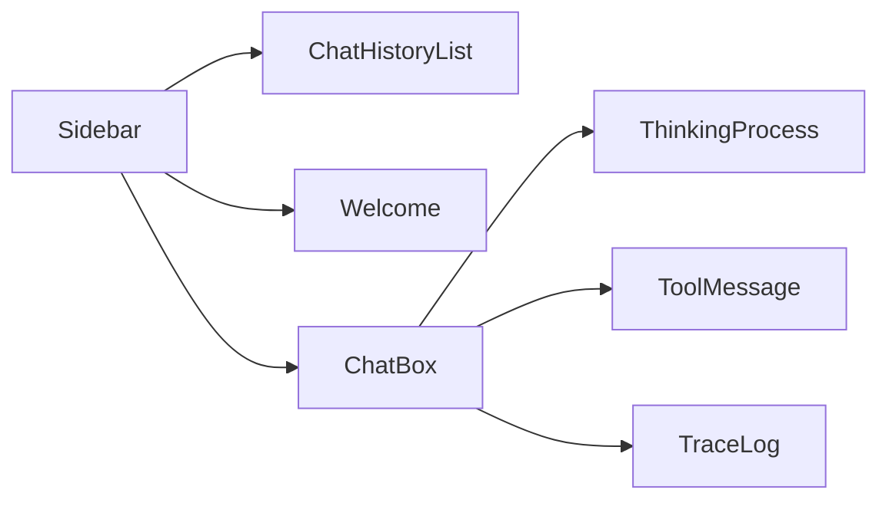

# 前端组件技术规格

> `frontend/src/components` - 主要 UI 组件集合（聊天、侧边栏、工具消息、追踪与思考过程展示等）

---

## 1. 组件清单

| 组件 | 文件 | 职责 |
|------|------|------|
| ChatBox | `ChatBox.vue` | 聊天输入与消息显示（含流式更新） |
| ChatHistoryList | `ChatHistoryList.vue` | 历史会话列表 |
| Sidebar | `Sidebar.vue` | 侧边栏导航与布局 |
| ThinkingProcess | `ThinkingProcess.vue` | 思考过程展示（如开启 trace/thinking） |
| ToolMessage | `ToolMessage.vue` | 工具调用/工具结果消息渲染 |
| TraceLog | `TraceLog.vue` | 调试追踪日志展示 |
| Welcome | `Welcome.vue` | 欢迎页/空状态 |

---

## 2. 常见交互

### 2.1 流式消息渲染

- `ChatBox` 负责把 SSE 的 `msg` 事件增量渲染到消息列表中（具体事件协议见 `docs/00-overview.md` 与 `docs/frontend/01-frontend-architecture.md`）。
- `ToolMessage` 用于展示 `msg_type=tool_call/tool_result` 的结构化内容。

### 2.2 布局关系（概念）

---

## 3. 约定（建议）

- 组件尽量保持“纯展示”，状态与请求逻辑优先放到 `stores/` 与 `api/`。
- Tool/Trace/Thinking 相关展示逻辑集中在 `ToolMessage` / `TraceLog` / `ThinkingProcess`，避免散落在多处重复解析。

